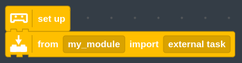
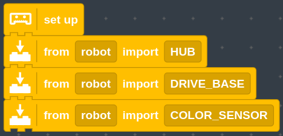
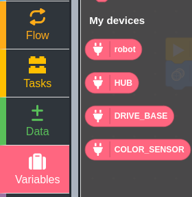
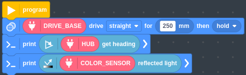
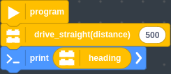
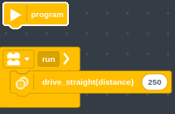

# pybricks-program-switcher

A template library to easily switch between pybricks programs.

This is mainly intended for teams who have some python programmers and some block coders. 

# usage
## getting started
1: download all the python files and upload them to the pybricks web IDE

2: update robot.py with all the motors/sensors and drive base relevant to your robot

3: in other programs, import every robot function (HUB,COLOR_SENSOR, DRIVE_BASE, etc.) from robot.py rather than defining it

## integrating block code
First, import the robot functions into the program you will be working on





You will notice that these devices are now available under the "My devices" tab the variables tab


You can use these devices in your block code




It is inconvenient to drag an extra block every time you want to do something, so you can create tasks to run these blocks for you. See block_template.py for examples. It is recommended to create one template and use it for all of your block-based programs.


You can then use these tasks to run your program:



When importing from a block file, ensure that the start program block is empty and all the code you want to run is in a task. You can name the task anything you want except for "main":


## using the switcher
```
from robot import *
```
4: use the robot functions you imported to build your program (see example_programs.py for examples)

5: once you have made your programs, add them to the switcher in main.py
```
from program_switcher import *
from <your_file> import <your_function_1>
from <your_file> import <your_function_2>
<program_1_name> = Program(<your_function_1>, <run_number>)
<program_2_name> = Program(<your_function_2>, <run_number>)

switcher = ProgramSwitcher()
switcher.add_programs([<program_1_name>, <program_2_name>])
```
6: run the switcher
```
switcher.run()
```

